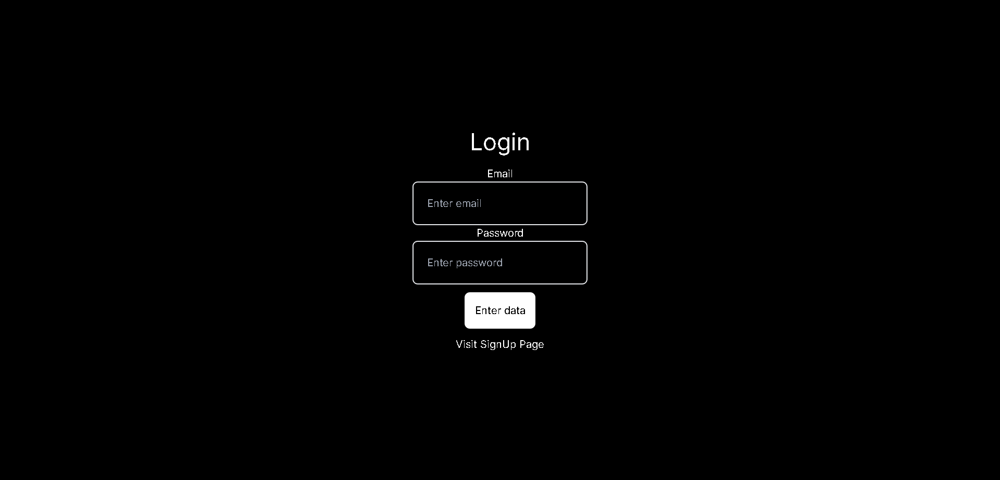
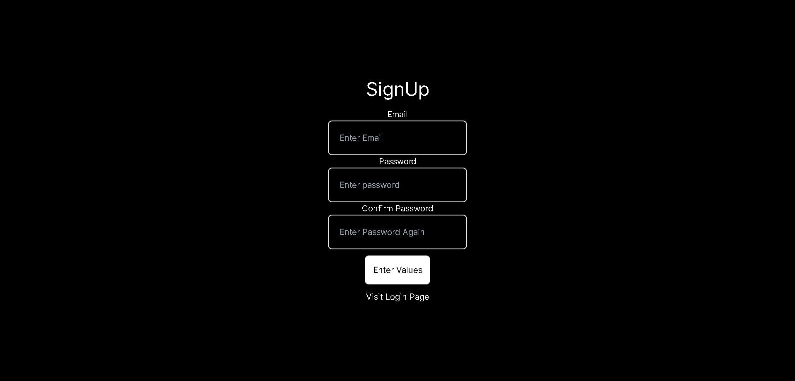
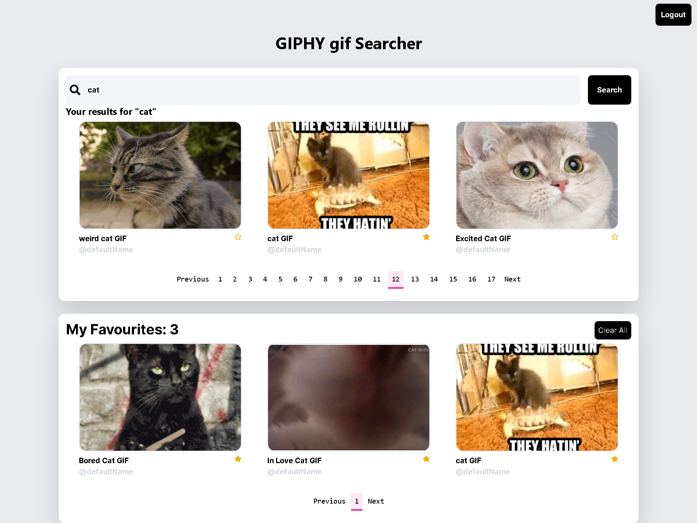

# Alpha Bi Giphy gif Searcher with Next js

A project for the full stack developer.

## Screenshots






## Demo

**While using the demo site use this Id to login or you can always create a new one**
```
email: user@gmail.com
password : 12345678
```


## Features

- User Authentication
- Pagination
- Saving the gif to favourites(using Redux)


## Technologies Used

- Next.js
- React 
- Axios
- Redux 
- Firebase(for use auth)
- React-hot-toast
- React-icons
- Tailwind Css

## Installation ⚡

**1. Clone this repo by running the following command :-**

```bash
 git clone https://github.com/Akarshit7/alphabiGiphySearch.git
 cd alphabiGiphySearch
```

**2. Now install all the required packages by running the following commands :-**

```
npm install
```

**2. Create your firebase project**

**3. Create a .env file in root folder and add the following**

```
NEXT_PUBLIC_FIREBASE_PUBLIC_API_KEY=<YOUR_API_KEY>
NEXT_PUBLIC_FIREBASE_AUTH_DOMAIN=<YOUR_DOMAIN>
NEXT_PUBLIC_FIREBASE_PROJECT_ID=<YOUR_PROJECT_ID>

NEXT_PRIVATE_GIPHY_API_KEY=<your_api_key>

```


**4. Now start the dev server by running the following command :-**

```
#Start dev the server
npm run dev
```

**5.** **🎉 Open your browser and go to `https://localhost:3000`**